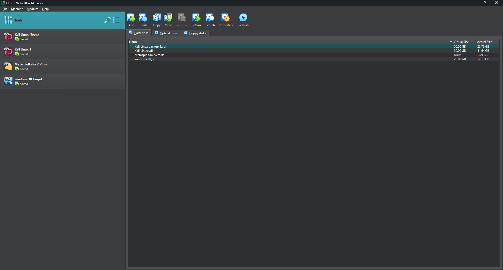
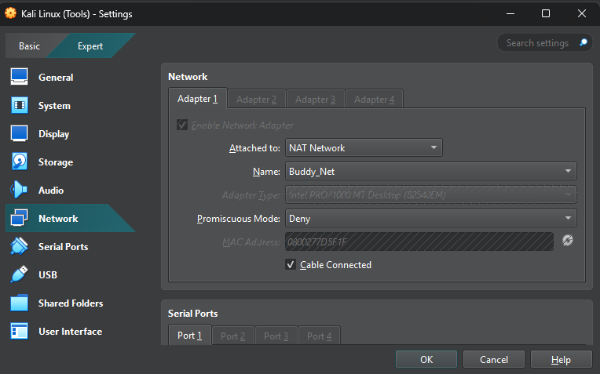
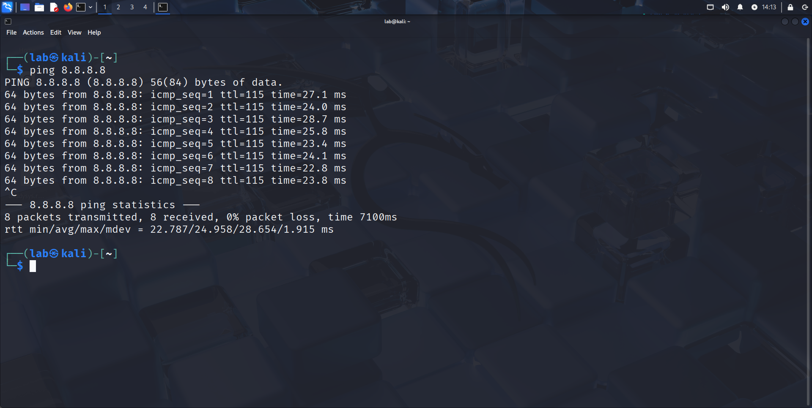

# Project: CyberSecurity Home Lab for Penetration Testing


## Overview
A personal allocated cybersecurity home lab built for a safe and controlled environment to conduct penetration testing.


## Setup

* Host Machine: Microsoft Windows 11 Home — 8GB RAM, 200GB storage disk allocated for project lab
* Virtual Machine: VirtualBox 7.1.8
* Attacker VM: Kali Linux 2025.2-installer-amd64
* Target VM(s):
  * Windows 10-x64
  * Metasploitable 2
* Tools Used:
  * Nmap
  * Metasploit
  * Wireshark


## Steps 

### Lab Setup

1. Installed VirtualBox and Initiated all virtual machines i.e Kali Linux, Windows 10, and vulnerable system (Metasploitable 2).

Figure 1 - Virtual Machines list in virtualbox.
<br>
<br>
2. Configured network adapter settings to ```NAT Network``` to enable all of the virtual machines to connect with the internet on a private network

Figure 2 - VirtualBox network settings
<br>
<br>
3. Then launched the terminal on the kali linux machine and checked network connectivity using ```ping``` command, and made sure all the other machines are operational and securely linked to the internet likewise

Figure 3 - Ping test form Kali Linux

### Lab Implementation

1. Scanned Metaploitable 2 for open ports and services with ```nmap```.

Figure 3 - Ping test form Kali Linux
<br>
<br>
2. Then launched the terminal on the kali linux machine and checked network connectivity using ```ping``` command, and made sure all the other machines are operational and securely linked to the internet likewise

Figure 3 - Ping test form Kali Linux
<br>
<br>
3. Then launched the terminal on the kali linux machine and checked network connectivity using ping command, and made sure all the other machines are operational and securely linked to the internet likewise

Figure 3 - Ping test form Kali Linux
