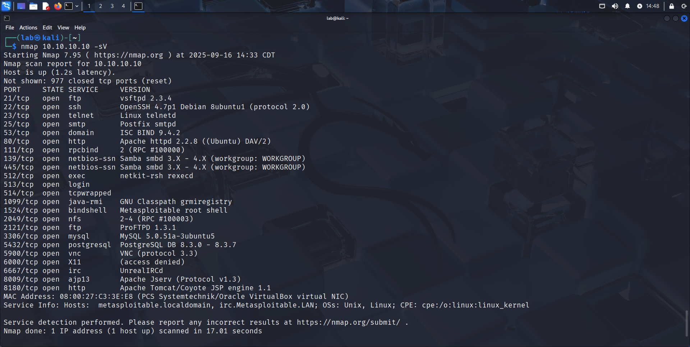
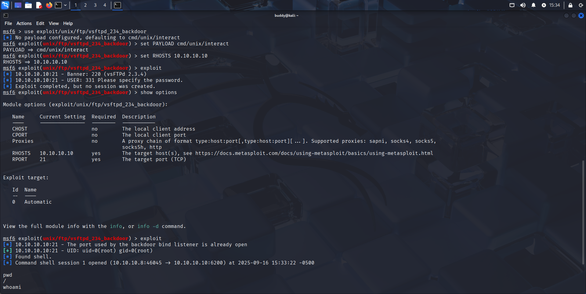
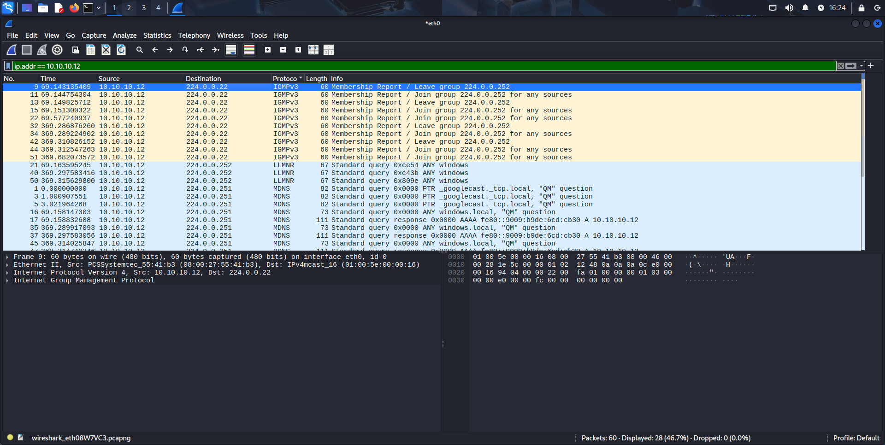
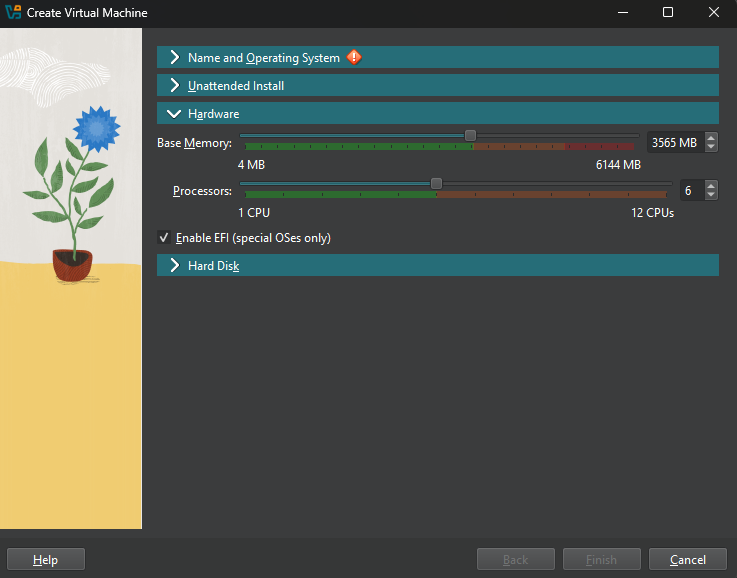
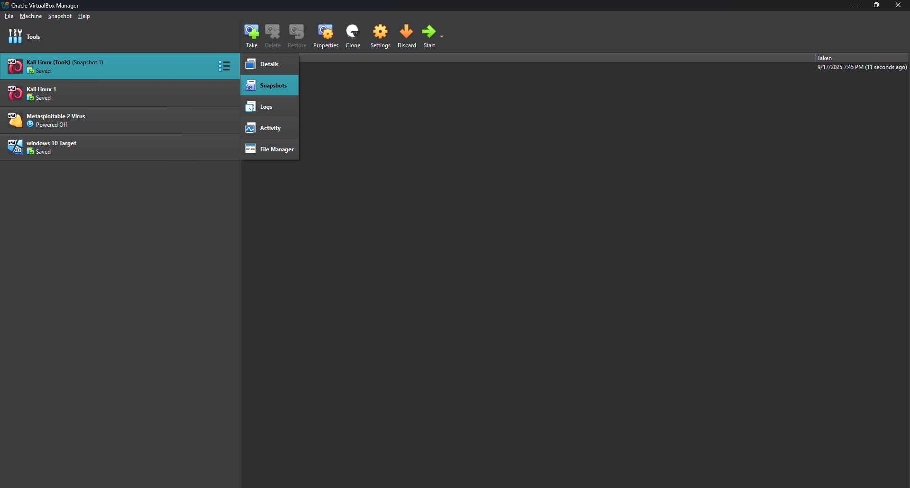

# Project: CyberSecurity Home Lab for Penetration Testing


## Overview
A personal allocated cybersecurity home lab provides a safe and controlled environment to conduct Penetration Testing, Vulnerability Assessment, Network Atatck/Defense.


## Setup

* Host Machine: Microsoft Windows 11 Home — 8GB RAM, 200GB storage disk allocated for project lab
* Virtual Machine: VirtualBox 7.1.8
* Attacker VM: Kali Linux 2025.2-installer-amd64
* Target VM(s):
  * Windows 10-x64
  * Metasploitable 2
* Tools Used:
  * Nmap
  * Metasploit
  * Wireshark


## Steps 

### Lab Setup

1. Installed VirtualBox and initiated all virtual machines i.e Kali Linux, Windows 10, and vulnerable system (Metasploitable 2).


<br>
<br>

2. Configured network adapter settings to ```NAT Network``` to enable all of the virtual machines to connect with the internet on a private network.


<br>
<br>

3. Then launched the terminal on the kali linux machine and checked network connectivity using ```ping``` command, and made sure all the other machines are operational and securely linked to the internet likewise.


### Lab Implementation

1. Scanned metaploitable 2 for open ports and services with ```nmap```.


<br>
<br>

2. Launched privilege escalation attack on Metasploitable 2 using ```metasploit```.


<br>
<br>

3. Assessed target Windows machine network activity using ```wireshark```.


## Tips

1. Initiating multiple virtual machines may slowedown the host machines which can be resolved by altering the RAM/CPU allocation.


<br>
<br>

2. Outdated system packages and software repositories can cause issue during scans and exploits which can be resolved by updating system packages and software repositories. For that open launch the terminal and run the following commands.
```sh
sudo apt update && sudo apt upgrade -y
```

<br>
<br>

3. Before performing critical exploitation tasks, use snapshots in VirtualBox so you have a backup in case the virtual machine becomes corrupted.



## Links
*  https://www.virtualbox.org/wiki/Downloads
*  https://www.kali.org/get-kali/#kali-installer-images
*  https://www.microsoft.com/en-us/software-download/windows10
*  https://www.vulnhub.com/entry/metasploitable-2,29
